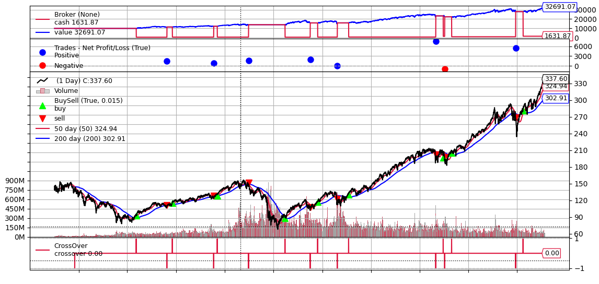
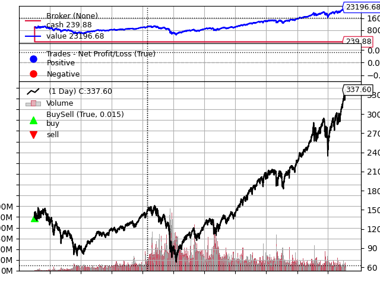

# Goldencross-buyhold-SPY

#### Note

* used argparse (Command-line parsing library) to load the strategies more easily


#### Results goldencross

```
Buy 99 shares of SPY at 95.110001
Sell 99 shares of SPY at 110.029999
Buy 92 shares of SPY at 117.279999
Sell 92 shares of SPY at 125.690002
Buy 89 shares of SPY at 130.410004
Sell 89 shares of SPY at 148.130005
Buy 148 shares of SPY at 89.349998
Sell 148 shares of SPY at 102.870003
Buy 127 shares of SPY at 118.349998
Sell 127 shares of SPY at 118.120003
Buy 114 shares of SPY at 131.320007
Sell 114 shares of SPY at 199.279999
Buy 108 shares of SPY at 204.860001
Sell 108 shares of SPY at 192.110001
Buy 102 shares of SPY at 208.610001
Sell 102 shares of SPY at 263.570007
Buy 92 shares of SPY at 285.829987
```



#### Results buyhold

```
10000.0
ROI:        131.97%
```

